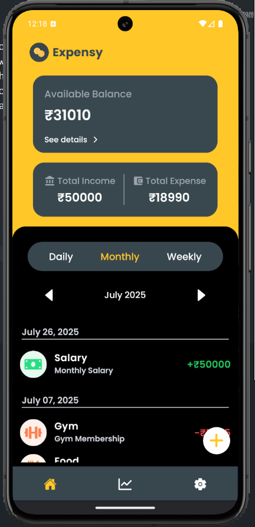
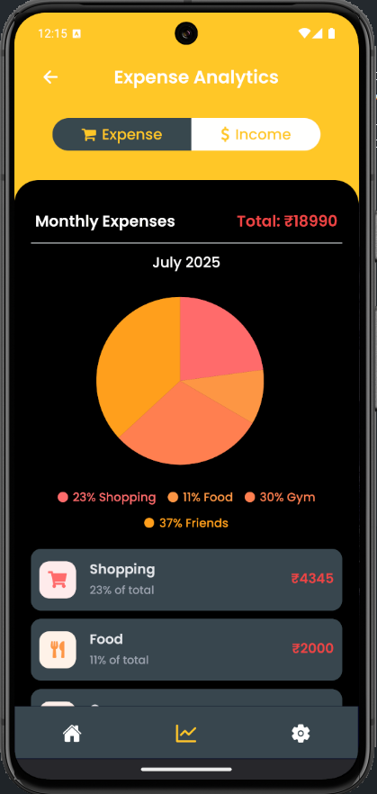
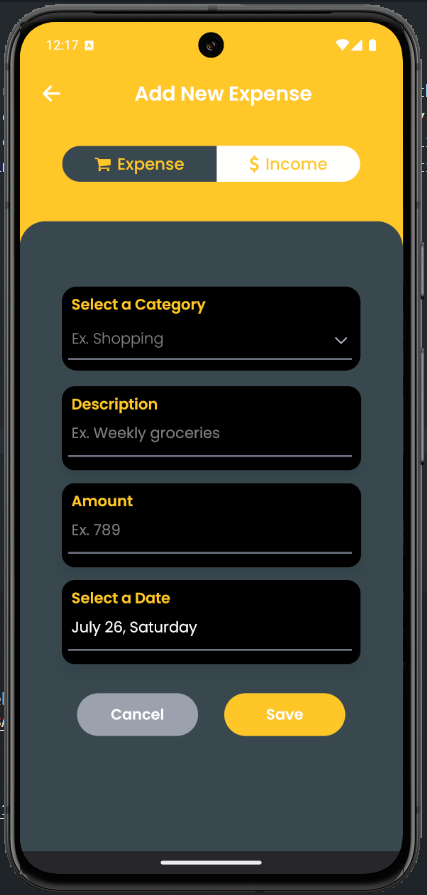
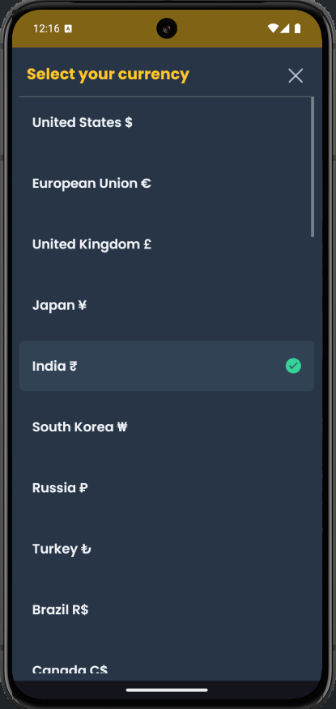
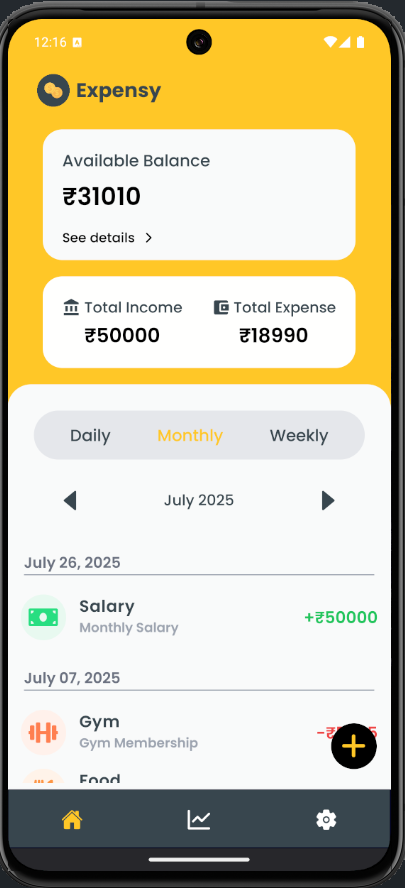

# Welcome to Expensy 🪙

Expensy is a simple and intuitive mobile app designed to help users manage their personal finances. With features to record daily expenses, categorize spending, and track budgets over time, the app empowers users to stay in control of their money. Built using React Native with Expo, it offers offline functionality through a local SQLite database with Drizzle ORM, ensuring access to your financial data anytime, anywhere. Whether you're trying to stick to a budget or just want to understand your spending habits better, Expensy makes it easy and effective.

## ScreenShots










## 🚀 Features

### 💸 Track Income & Expenses
- Add entries as **income** or **expense**
- Organize your finances with **custom categories**

### 📊 Visual Analytics
- View spending and earnings via **beautiful charts**
- Filter by **daily, weekly, or monthly** usage
- Dedicated **Analytics Page** with graphical insights

### 🌗 Light & Dark Mode
- Supports both **light** and **dark themes**
- Automatically follow system preference or choose manually

### 🌍 Currency Flexibility
- Choose your preferred **currency symbol**
- Personalized financial tracking for any region

### 📱 Offline-First, Private by Design
- **No internet required** – all data is stored locally
- Data stays **on your device only** – no cloud sync or third-party storage
- Built with a **local-first approach** to maximize privacy and reliability

### 🗃️ Local Database & Storage
- Uses **SQLite** with **Drizzle ORM** for structured, offline data storage
- User preferences (theme, currency, etc.) stored using **AsyncStorage** from React Native


## Get started Locally

1. Install dependencies

   ```bash
   npm install
   ```

2. Prebuild the app

   ```bash
   npx expo prebuild
   ```

2. Start the app

   ```bash
   npx expo run
   ```

## Author

Developed by: Sheikh Airaad  
Email: sheikhairaad@gmail.com  
Website: [Portfolio](https://portfolio-nextjs-steel-mu.vercel.app/)

## 📦 Download

📲 **[Download for Android via Expo](https://expo.dev/accounts/airaad/projects/Expensy/builds/3623c3d2-6f0b-4fcb-a312-8e4f5c805a74)** 
> ⚠️ *Not yet available on the Play Store. You can download and install it directly from the Expo website.*
 
🍎 **iOS version coming soon...**


